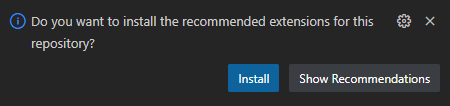
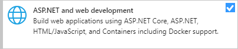
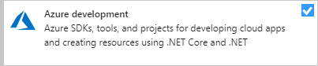
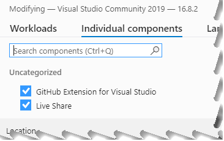
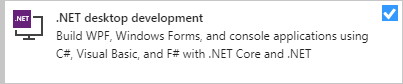
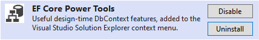
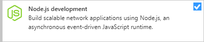

# CPSC-1012 - **Instructor Workbook** (Sep 2022 | A05)

- [Getting Started as a C# Developer](https://www.linkedin.com/learning/paths/getting-started-as-a-c-sharp-developer?u=2109516) on Linked-In Learning - 20h 22m series of 9 videos
- [Learn C# for beginners](https://www.youtube.com/watch?v=EtNd4eH9Wrk&list=PLhq7kqloVlM95ROEbGpJEdpadDmtrC343) - 65 short-and-to-the-point videos on learning C#
- [C# Fundamentals for Beginners](https://youtu.be/0QUgvfuKvWU) - 8 hr video for absolute beginners
- [Learn C# BASICS in 10 MINUTES!](https://youtu.be/IFayQioG71A)
- [Top 10 C# Best Practices (plus bonuses)](https://youtu.be/-9b8NRqjUFM)
- :bulb: [Learn C#](https://learn.microsoft.com/en-us/users/dotnet/collections/yz26f8y64n7k07) by Microsoft

> **Dan Gilleland**

This repository is based off of the **Student Workbook** containing [**demos**, **tutorials** and **practice materials**](./src/ReadMe.md). Learning Outcomes ([**LOGs**](./docs/learning_outcomes/ReadMe.md)) and other useful notes can be found in the [**docs** folder](./docs). Also, you are encouraged to use the [**docs/mynotes**](./docs/mynotes) folder for journaling what you are learning throughout this course.

> :warning: **Do *NOT*** use this repository for any assignments that are worth marks. :warning:

Additionally, you can find online notes at the [MS Teams Site](https://www.microsoft.com/en-ca/microsoft-teams/log-in) for the course. Also be sure to checkout out the topical [**Learning Outcomes**](https://.github.io/about/LOGs.html) used in class.

----

##  Software & Resources

Required tools for this course include:

- [Visual Studio Code](https://code.visualstudio.com) (see [Notes]() on VS Code extensions)
  - Alternatively, you can use [Visual Studio 2022, Community Edition](https://visualstudio.microsoft.com/) (see [Notes](#vs-2022-community) on the minimum version)
- [Git for Windows/macOS/Linux](https://git-scm.com/downloads)
- [GitHub CLI](https://cli.github.com/) (*Command-Line Interface*)

Other recommended resources include:

- [Learn Markdown](https://commonmark.org/help/)
- [Programming Fundamentals - An Object-Oriented Introduction to Programming in C#](https://programming-0101.github.io/TheBook/)

Advanced resources outside the scope of this course include:

- [Azure Developer Tools](https://azureforeducation.microsoft.com/devtools) - Sign in with your school-issued email address to get access to the free resources offered by Microsoft.

----

### VS Code

This term, I will be focusing on using **Visual Studio Code** as the primary editor. Notice how in your workbook, you will have *recommended extensions*; I've also added a few more extensions. Here's the list that I will be using this term.

- [CodeTour](https://marketplace.visualstudio.com/items?itemName=vsls-contrib.codetour)
- [Markdown All in One](https://marketplace.visualstudio.com/items?itemName=yzhang.markdown-all-in-one)
- [Markdown PDF](https://marketplace.visualstudio.com/items?itemName=yzane.markdown-pdf)
- [PDF Preview](https://marketplace.visualstudio.com/items?itemName=analytic-signal.preview-pdf)
- [SQL Server (mssql)](https://marketplace.visualstudio.com/items?itemName=ms-mssql.mssql)
- [Markdown Emoji](https://marketplace.visualstudio.com/items?itemName=bierner.markdown-emoji)
- [**C#**](https://marketplace.visualstudio.com/items?itemName=ms-dotnettools.csharp)
- [**Git Extension Pack**](https://marketplace.visualstudio.com/items?itemName=donjayamanne.git-extension-pack)
- [**Git Graph**](https://marketplace.visualstudio.com/items?itemName=mhutchie.git-graph)

----

### VS 2022 Community

The latest version of [**Visual Studio 2022**](https://visualstudio.microsoft.com/) should be sufficient. If you need to upgrade, launch the Visual Studio Installer and upgrade through that tool.

|  |  |
|--------------------------------------------------------|----------------------------------------------------------------------|

You also should ensure you have the required workflows and components for this course.

| Required Workflows | Recommended Workflows | Individual Components | Extensions |
|--------------------|-----------------------|-----------------------|------------|
|  |  |  |  |
|  |  | |  |
| |  | | |
| |  | | |
| |  | | |
