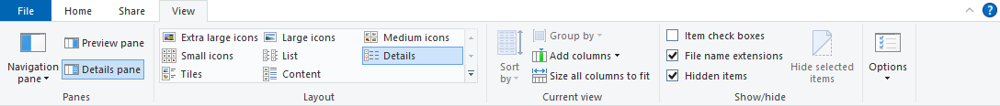
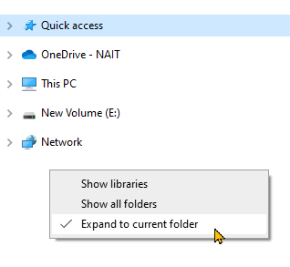

# One-Time Computer Setup

Odds are, file explorer on your computer is set up to not show file extensions and hidden files. You can change this in the View tab.

I also recommend to have the tree view on File Explorer's left side expand to the current folder. You can enable this by right-clicking on some white space in the tree view area and selecting "Expand to current folder".

