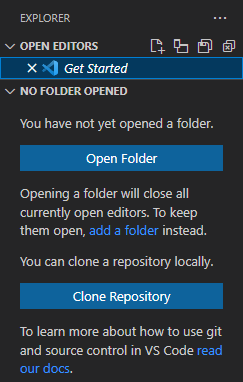

# Using VS Code

Visual Studio Code is an IDE that is highly keyboard-focused, which is great for developers who like to minimize the use of the mouse (like me).

## Side Panel Controls

###  Explorer

You can click on the icon or use the keyboard shortcut combo <kbd>Ctrl</kbd> + <kbd>Shift</kbd> + <kbd>e</kbd>.

The explorer allows you to view the files and folders in your currently active folder. I recommend always working in an open folder. So, if you see the following image, just click on either "Open Folder" or "Clone Repository".

###  Source Control

You can click on the icon or use the keyboard shortcut combo <kbd>Ctrl</kbd> + <kbd>Shift</kbd> + <kbd>g</kbd>, <kbd>g</kbd>.

Read about [git support](https://code.visualstudio.com/docs/editor/versioncontrol#_git-support), especially the use of the **Source Control** side panel.

----

## Keyboard Shortcuts

> TBA
> 