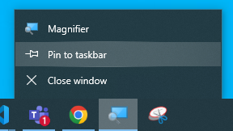

# Beginner Notes

> **If it's important enough to remember, it's important enough to write down!**

## File Explorer

For one-time setup of File Explorer remember to

- View file extensions
- View hidden items
- Open to current folder

For frequently used programs, remember to pin to the taskbar by right-clicking on the program in the taskbar.



## DOS Commands

> TODO: From last class

## VS Code Commands


The following will re-open Visual Studio Code to the current folder.

```
code -r .
```


## DotNet Commands

> TODO: From last class
