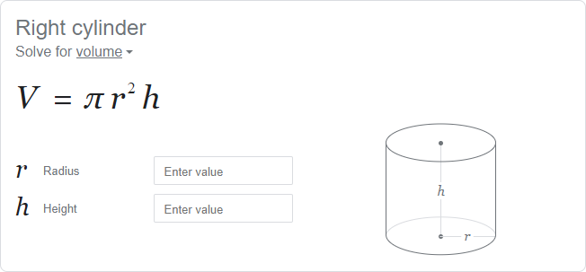
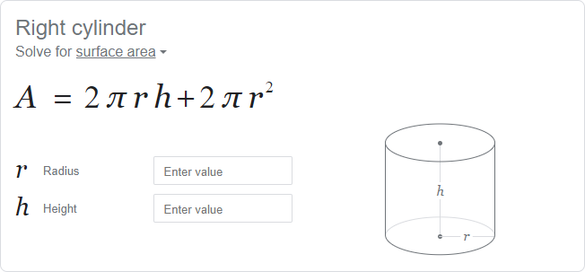

# Cylinder Calculations

## Problem Statement

> Given the radius and height of a cylinder (supplied by the user), calculate the volume and the surface area.

## Solving the Problem

- [**Cylinder**](https://programming-0101.github.io/TheBook/Topic/E/Practice/Cylinder.html) calculations - given the $radius$ and the $height$, find the [volume](https://www.google.com/search?q=Volume+of+a+Cylinder) and the [surface area](https://www.google.com/search?q=Surface+Area+of+a+Cylinder). The formulas are:
  - $\text{Volume of a Cylinder} = pi \cdot r^2 \cdot h$
  - $\text{Surface Area of a Cylinder} = 2 \cdot pi \cdot r^2 + 2 \cdot pi \cdot r \cdot h$

## Planning Test Cases

## Writing the Code

## Checking for Accuracy
