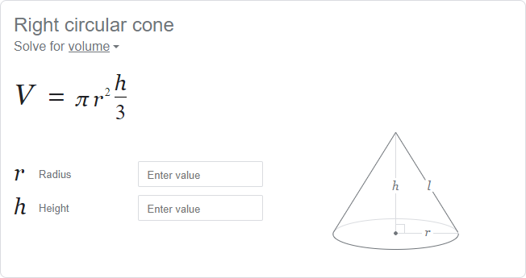
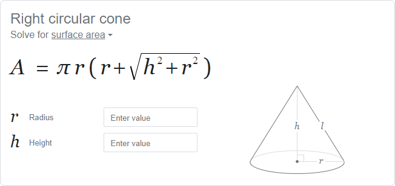

# Cone Calculations

## Problem Statement

> Given the radius and height of a cone (supplied by the user), calculate the volume and the surface area.

## Solving the Problem

- [**Cone**](https://programming-0101.github.io/TheBook/Topic/E/Practice/Cone.html) calculations - given the base radius $r$ and the height $h$, find the [volume](https://www.google.com/search?q=Volume+of+a+Cone) and the [surface area](https://www.google.com/search?q=Surface+Area+of+a+Cone). The formulas are:
  - $\text{Volume of a Cone} = \frac{1}{3} \cdot pi \cdot r^2 \cdot h$
  - $\text{Surface Area of a Cone} = \pi \cdot r \cdot (r + \sqrt{h^2 + r^2})$

## Planning Test Cases

## Writing the Code

## Checking for Accuracy
