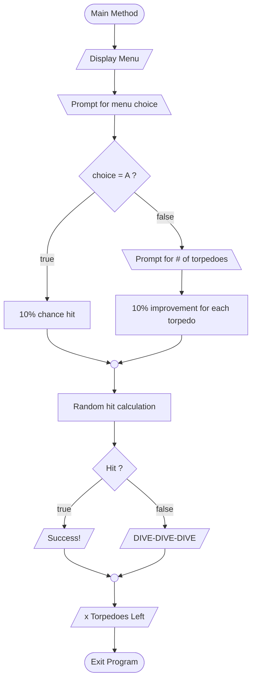

# If/Else Demo

Let's create a simple submarine game to demonstrate some if/else logic.

> Create a game that allows a submarinar to launch one or more torpedoes. It will randomly determine if the launched torpedo(es) hit or not. Then it will display the number of remaining torpedoes.
> 
> 
> 
> Our game will have a set of 10 torpedoes available. For each torpedo launched, the chance of a hit goes up by 10%.

----

In this game, we can identify a number of inputs and outputs. Since we want the user to launch one or more torpeodoes, we can present them with a simple menu selection.

```
Submarine Game

A) Launch a torpedo
B) Launch more than one torpedo
```

If the user chooses to launch multiple torpedoes, we will have to ask them how many.

Here is how that logic would look in a flowchart.




----

Image Credits:

- [Torpedo icons created by Freepik - Flaticon](https://www.flaticon.com/free-icons/torpedo)
- [Navy Image by macrovector_official](https://www.freepik.com/free-vector/military-boats-isometric-flowchart-composition-with-different-types-boats-frigates-cruisers-battleships-hovercrafts-vector-illustration_4330481.htm#query=torpedo&position=47&from_view=search) on Freepik
