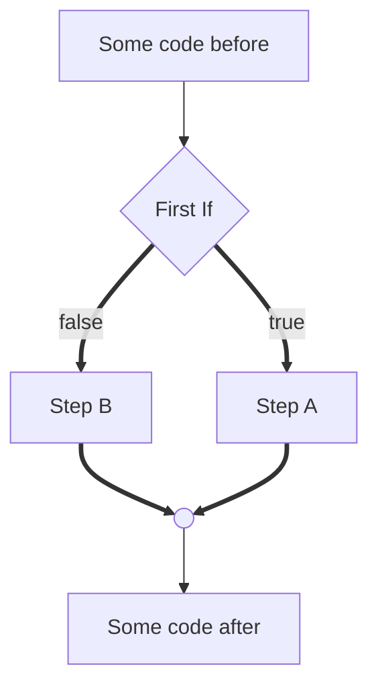
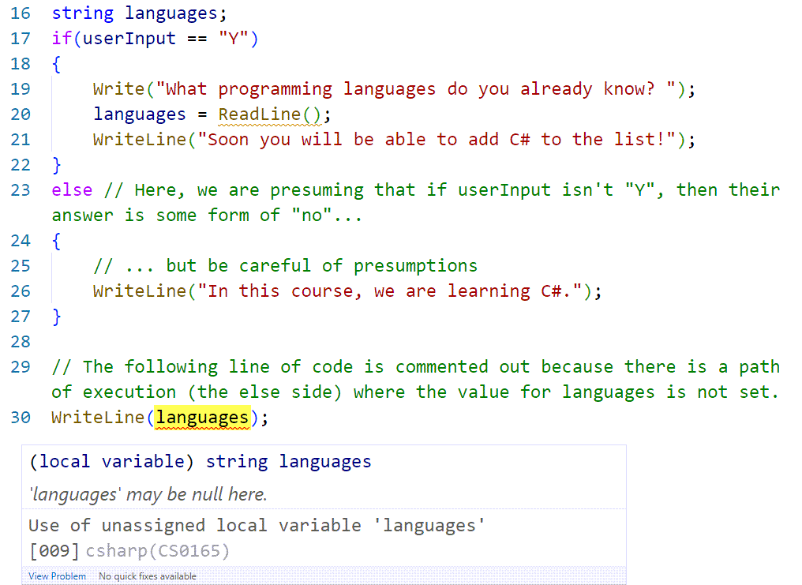
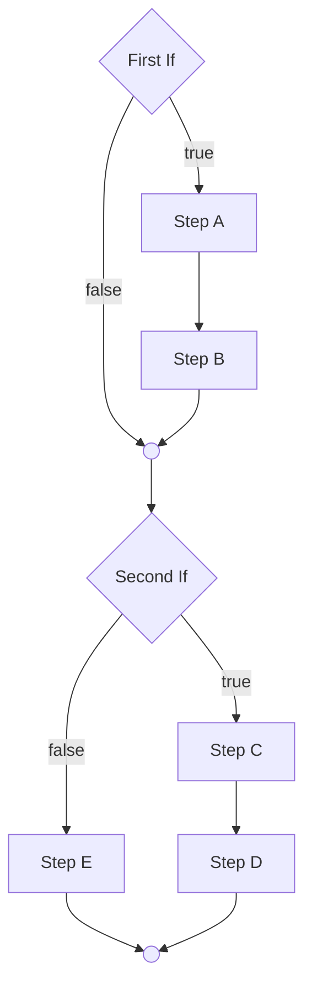
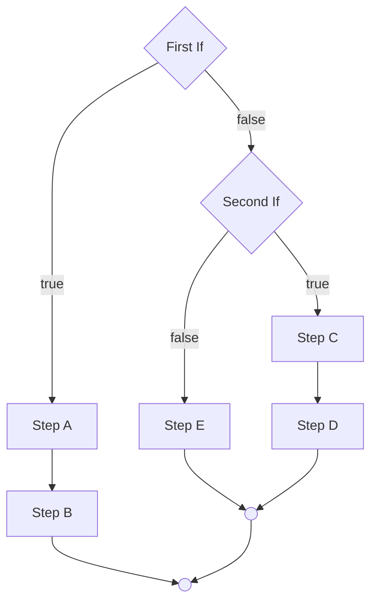
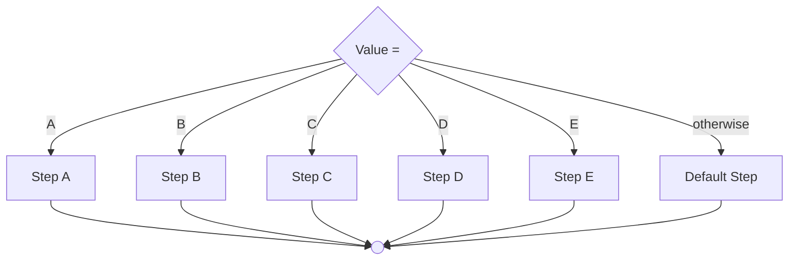

# Decision Structures

**If-Else** and **Switch-Case** are the standard decision statements for providing *alternate paths of logic* during our program's execution. These are also part of the group of statements known as ***flow control*** statements.

In a flowchart, the If-Else would look like this:



If-Else statements only have two possible paths of logic - the `true` side and the `false` side. The [Case structure](#case-structure) can have more than two alternate paths of logic. At the end of both structures, the paths of logic converge to resume with the rest of the program's execution.

- **Review the grammar for**
  - [ ] [If-Else](https://programming-0101.github.io/TheBook/Teach/chapter1-7.html#if-else)
  - [ ] [Switch-Case](https://programming-0101.github.io/TheBook/Teach/chapter1-7.html#switch-case)


----

## Paths of Logic and Unassigned Variables

If you try to use a variable whose value is assigned only through *some* but not *all* possible paths of logic, the compiler will flag an "Unassigned variable" error, as shown in this code sample.



For each of the following flowchart examples, identify how many possible execution paths there are.

----

## Stacked Structures



----

## Nested Structures



----

## Case Structure



----

## Mixed Examples

> TODO: Draw on whiteboard

```mermaid
flowchart TD

```

----
