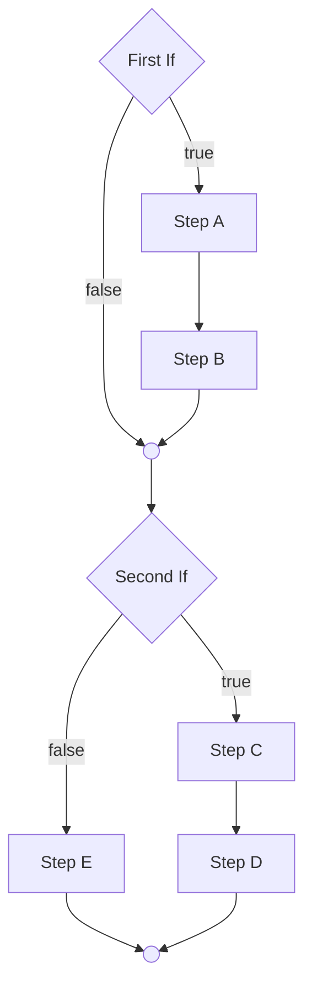
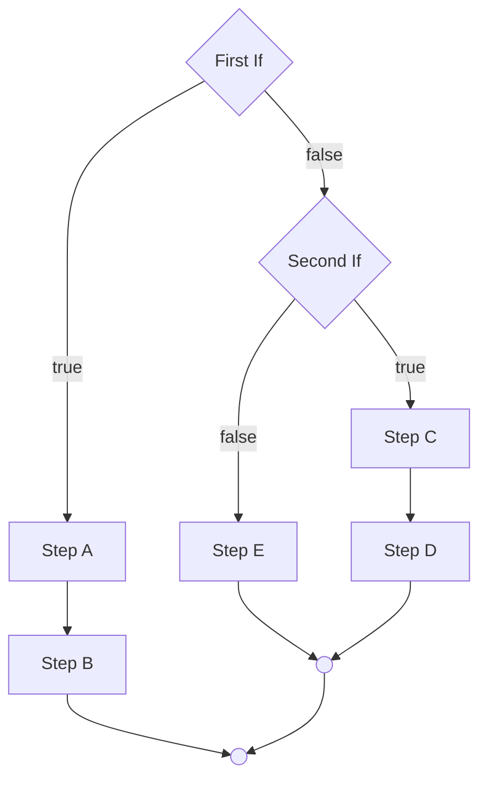
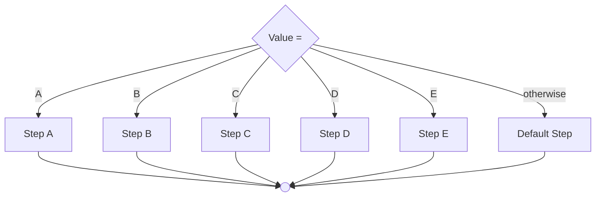

# Decision Structures

- Review the grammar for
  - [If-Else](https://programming-0101.github.io/TheBook/Teach/chapter1-7.html#if-else)
  - [Switch-Case](https://programming-0101.github.io/TheBook/Teach/chapter1-7.html#switch-case)


For each of the flowchart examples, identify how many possible execution paths there are.

----

## Stacked Structures



----

## Nested Structures



----

## Case Structure



----

## Mixed Examples

> TODO: Draw on whiteboard

```mermaid
flowchart TD

```

----
