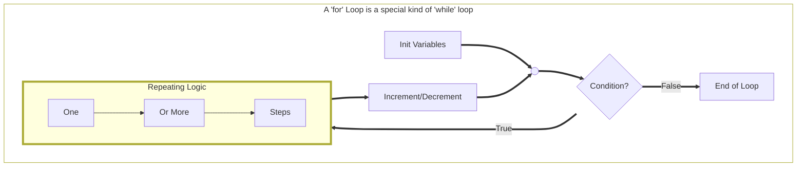

# Methods, Validating User Input, and Looping Structures

Start with a console app that uses top-level programs - `dotnet new console`

- [ ] `static string PromptText(string message)`
- [ ] `static int PromptInt(string message)`
- [ ] `static double PromptDouble(string message)`
- [ ] `static bool PromptRepeat(string message, string default)`

Create a new torpedo game, but this time, make the main body act like a [general driver](https://programming-0101.github.io/TheBook/Teach/console-2.html)

Re-do in [020](../020) as a traditional Program class with a Main method.

----

## Comparing `for` And `while` Loops

A `for` loop is simply a `while` loop that surrounds the <kbd>`Conditional Expression`</kbd> with the <kbd>`Init Variables`</kbd> and <kbd>`Increment/Decrement`</kbd>. This is done when the `Conditional Expression` is directly affected by the values in the `Init Variables` and `Increment/Decrement` blocks. It effectively brings together all the logic affecting the continuation of the loop into one place, making it easier to visualize the control of the loop.

