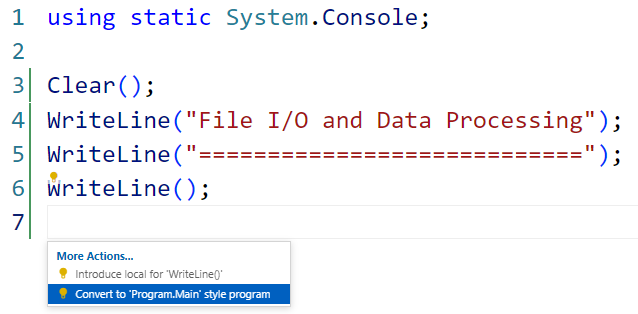

# File I/O and Data Processing

When it comes to working with files on the local computer, using the `File` and `Directory` classes is the simplest and best for relatively small files. If you are doing more involved file processing, or if you are working with large files, consider using the [`FileStream`](https://learn.microsoft.com/en-us/dotnet/api/system.io.filestream?view=net-6.0) class.

Read the following articles:

- [File and Stream I/O](https://learn.microsoft.com/en-us/dotnet/standard/io/)
- [C# - Stream](https://www.tutorialsteacher.com/csharp/csharp-stream-io)
- [C# FileStream Tutorial With Programming Example](https://www.completecsharptutorial.com/basic/c-filestream-tutorial-with-programming-example.php)

## Hands-On-Tutorial

Modify the existing Program.cs from a Top-Level Program to a traditional Program.Main by opening the file and pressing <kbd>Ctrl</kbd> + <kbd>.</kbd>.

