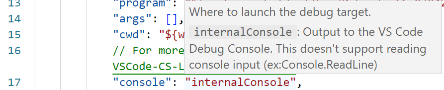

# Debugging in VS Code

1. Make sure that this folder is the "root" folder in the Explorer view.
2. Click the **Run and debug** () icon
3. Set up your debugging by setting your [`launch.json`](./.vscode/launch.json) to use either the `"externalTerminal"` or the `"integratedTerminal"` for the `"console"`

Note the comment on the use of the `"internalConsole"` and how it does not support reading console input. That's why we should use either the external or internal *terminals* instead.

