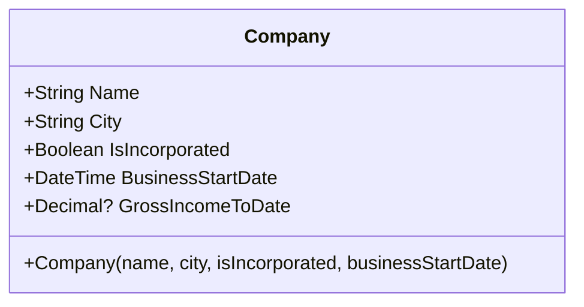

# Understanding DateTime

The following demo illustrates various aspects of the `DateTime` data type, such as the `.Year`, `.Month`, `.Day` and `.DayOfWeek` properties and the ability to compare as well as add/subtract dates.

To begin, we will start with a simple class that represents information about a company.

For this class, we will add some additional methods.

- `bool IsOpen(DateTime onDate)` - Closed on Saturday and Sunday
- `void SetFiscalYearEnd(MonthName month, int Day)` - Set the company's fiscal year end
- `int DaysRemainingInFiscalYear(DateTime fromDate)` - Calculate the number of days from the supplied date to the end of the fiscal year

We'll also add the following properties for the fiscal year end (which should default to the end of the calendar year - Dec 31).

- `MonthName YearEndMonth`
- `int YearEndDay`
