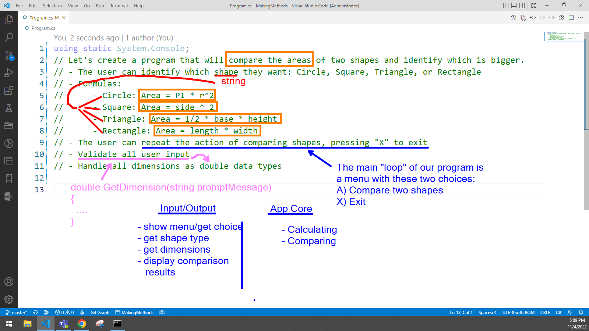
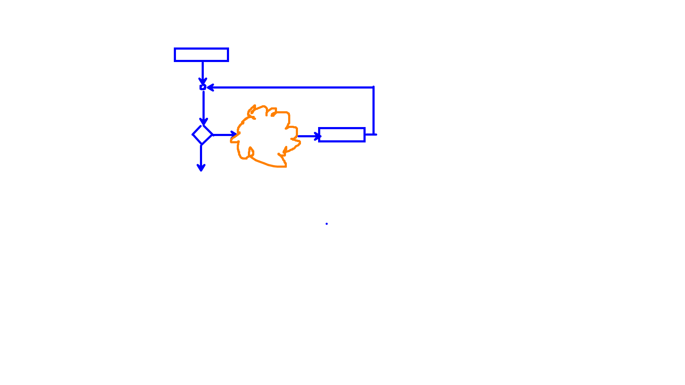
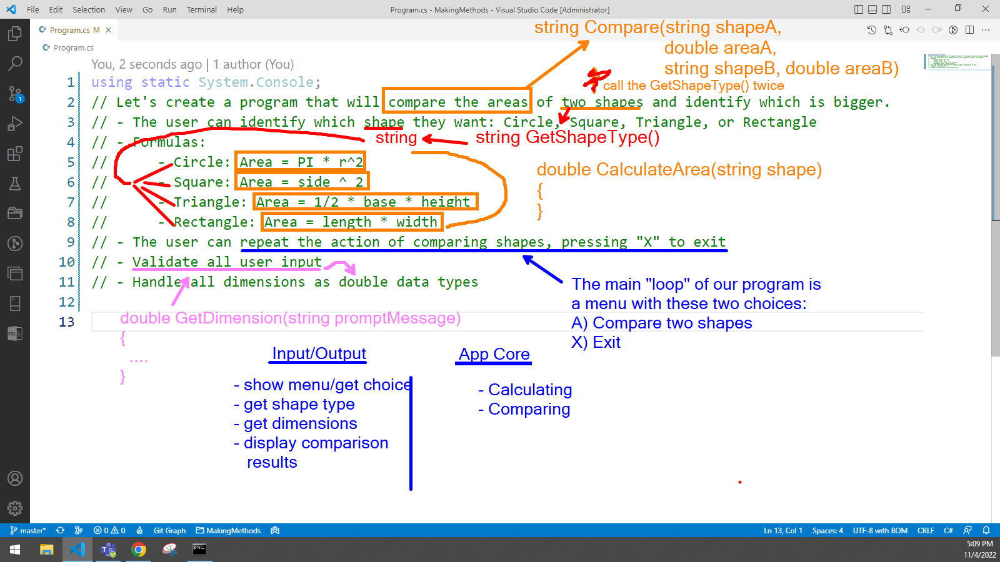

# Making Methods and Modularizing Solutions

Consider the following problem.

> Let's create a program that will compare the areas of two shapes and identify which is bigger.
> 
> - The user can identify which shape they want: Circle, Square, Triangle, or Rectangle
> - Formulas:
>   - **Circle**: Area = PI * r^2
>   - **Square**: Area = side ^ 2
>   - **Triangle**: Area = 1/2 * base * height
>   - **Rectangle**: Area = length * width
> - The user can repeat the action of comparing shapes, pressing "X" to exit
> - Validate all user input
> - Handle all dimensions as double data types

How would we analyze the problem? What kinds of questions should we be asking ourselves?

Our most important challenges are to

1. Make sure we *understand* what the problem is asking us to do
2. Group together related parts of the problem

Here is an image showing how I analyzed what needed to be done.



When I was satisfied with the way I grouped the parts of the problem, I suggested methods to handle those tasks. The key thing to think about when coming up with those methods is to imagine the following:

1. What will the method *do* (this should be reflected in its name)?
2. What information will the method need to do the task (these are probably going to be parameters for the method)?
3. What information will the method *return* as a result of accomplishing its task?

The driver of my program is typically just a loop where I determine if the program should continue or exit.



The methods I came up with from my analysis are as follows:



Now I just need to decide on the order in which to do those methods. For the sake of argument, I'll just start with a familiar one of prompting for a valid dimension - `double GetDimension(string promptMessage)`.

```csharp
double GetDimension(string promptMessage)
{
    Write(promptMessage);
    double result;
    while(! double.TryParse(ReadLine(), out result) || result <= 0)
    {
        WriteLine("\tThat was not a valid number. Enter a number larger than zero");
        Write(promptMessage);
    }
    return result; // A method can only explicitly return ONE thing.
}
```

> :bulb: **TIP:** It's always best to start small, and then "test" your methods to see if they can "stand on their own": Does it do what you intended it to do?

----

## Colophon

- Drawing tool is [ZoomIt](https://learn.microsoft.com/en-us/sysinternals/downloads/zoomit) by Microsoft

